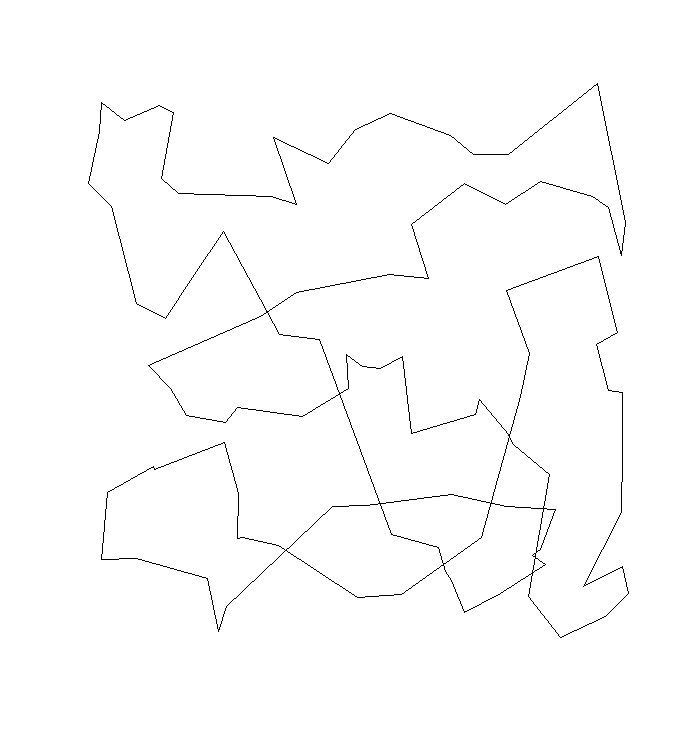

# FTPOptimizTSPChallenge

This repository contains the code written as part of the travelling salesman problem (TSP) challenge
in the fundamental theoretical principle (FTP) module on optimisation in the autumn term 2017/18.
This module is part of the Master of Science in Engineering (MSE),
a joint degree programme by all seven public Universities of Applied Sciences of Switzerland.

## Problem Description and Result

The goal is to find the shortest route visiting all [100 random points](00_data/points.csv) exactly once and returing to the start.
The [50 shortest routes found](00_data/routes.csv) are also included in this repository.

The winning route has a distance of only `9.850192716`.

|             Original Route            |            Winning Route            |
|:-------------------------------------:|:-----------------------------------:|
|  |  |
